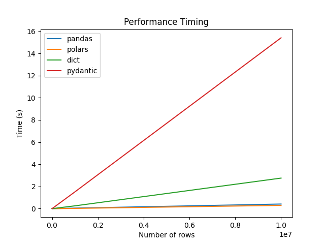
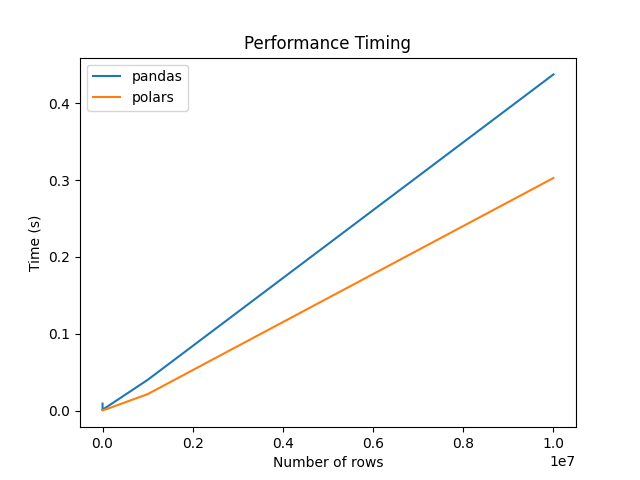

# Streamlined Model Deployment with Pex
## Table of Contents
1. [Problem Statement](#problem-statement)
2. [Proposed Solution](#proposed-solution)
3. [Pex Runtime](#pex-runtime)
4. [Proof of Concept](#proof-of-concept)
5. [Interprocess Communication](#interprocess-communication)
6. [Try it out](#try-it-out)
7. [Additional Resources](#additional-resources)

## Problem Statement

You have a complex modelling framework with numerous independent models. 
The modelling framework is written in Python and you want to deploy it to a production environment. Due to the nature of these models, in their current state, they cannot be pre-trained and therefore perform training and inference at runtime. 

Given that models are git backed and all models are deployed at the same time, the risk of changing a given model to address a client specific need implies risk that this change would adversely affect other clients.

Furthermore, due to the single deployment single source of truth pattern, the rate at which models can be altered and deployed is slow. Typically this requires two pull requests and an intermediate deployment to a staging environment.

If python could be compiled to static binaries and deployed as such, this would allow for a more streamlined deployment process. There are three noteworthy projects that aim to achieve exactly this:

1. [PyOxidizer](https://gregoryszorc.com/docs/pyoxidizer/main/pyoxidizer_packaging_python_files.html)
This project aims to compile python packages into a single standalone runtime using Rust. Although this is interesting and works exceptionally well for non-scientific python packages. The challenges of compliing complex binaries such as numpy and scipy are not trivial.
2. [Nuitka](https://nuitka.net/doc/user-manual.html#build-it-using)
Nuitka is a python to C++ compiler. This project is very interesting and has a lot of potential. However, it suffers the same problem as PyOxidizer in that it does not readily support numpy and scipy.
3. [Mojo](https://docs.modular.com/mojo/manual/python/#import-a-python-module)
Mojo is a superset of Python that does support the compilation of native Mojo binaries. As of writing mojo does not include/compile imported python packages. Once this feature is made available this will be the future of scientific python runtime environments.

### In Summary

Monolithic python modelling frameworks are:
1. difficult to deploy.
2. slow to deploy.
3. introduce risk when deploying client specific changes.
4. impossible to version control at the model level.


## Proposed Solution
Before stepping into the solution, let's consider the challenges deploying a python model in a production environment. 

For a given python model three core components are required:

1. Python Runtime (runtime)
2. Base External Python Packages (base)
3. Model Code (model)

So a given model can be represented as:

```
Deployment = runtime + base + model
```
Typically the runtime is supplied by docker, the base is defined by pyproject.toml and the model is defined by the model code.

The steps in pushing something to production is therefore:

1. Add base model dependencies to pyproject.toml
2. Update model repository wuth new model code
3. Write unit and integration tests for model
4. Open pull request for model
5. Merge pull request for model
6. Build docker image using specific python runtime
7. Deploy docker image to staging environment
8. Run smoke tests on staging environment
9. Deploy docker image to production environment

Now, imagine a hypothetical environment where runtime, model and base can be managed and deployed independently. This would mean that the runtime i.e. python version would change very infrequently. The base would change if the core dependencies of the model changed which is more frequent but not significantly so. The model would change frequently as new features are added and bugs are fixed.

This deployment pattern would look like this:

Runtime:
1. Define runtime dependencies in dockerfile
2. Deploy docker image 

Base:
1. Define base dependencies in pyproject.toml
2. Version base using pyproject.toml
2. Deploy base dependencies (more on this later)

Model:
1. Create new model folder that inherits from base, but can also specify it's own dependencies
2. Version model using pyproject.toml
2. Write unit and integration tests for model
4. Open pull request for model
5. Merge pull request for model
6. Deploy model code (more on this later)

Using this pattern the Runtime and Base, which are cumbersome and slow to deploy happens infrequently. The Model, which is the most frequent change, can be deployed independently of the Runtime and Base. This means that the Model can be deployed quickly and with minimal risk. 

As models are deployed independently, the can be versioned independtly, and the risk of changing a given model to address a client specific need implies risk that this change would adversely affect other clients is mitigated.

The other benefit is that the bundle size of a given deployment. Here are some typical bundle sizes for a given deployment:

```
Runtime: - Docker Python 3.11 Slim Buster  - 114MB
Base: - Numpy, Scipy, Pandas, Scikit-Learn - 192MB
Model: - +/-1MB

Deployment = 114MB + 192MB + 1MB = 307MB
```

## Pex Runtime
Pex is a python to python compiler. It compiles python code into a single binary that can be executed. The binary is a self contained / isolated python runtime that includes all the dependencies of the python code. This means that the runtime is not dependent on the python version installed on the host machine. This makes use of [PEP 441](https://peps.python.org/pep-0441/) which is a python standard for packaging python code into a zip file that can be executed as a binary

Pex adresses our deployment decompostion as follows:

Runtime: Pex uses python supplied by docker / operating system
Base: Pex can build a self-contained base runtime 
Model: Pex can build a self-contained model runtime with all the dependencies of the model

Lastly, pex runtimes are additive, in other words a model pex file can be added to a base pex file to create a new pex file that includes the base and model dependencies. This is a very powerful feature as it allows for the creation of a single pex file that includes the runtime, base and model dependencies. This means that the deployment bundle size is reduced to the size of the model pex file.

# Proof of concept
As a proof of concept consider the following repository that contains a base model runtime in conjunction with a single model. The model and base have a shared dependency, namely `base.ipc`, as well as other dependencies that are unique to the model and base respectively. 

In this example the model uses `pydantic` whereas the base class does not.
The app itself simply runs a script to time how long it takes to share in memory data between two processes (more on this later). 

```
.
├── base
│   ├── __init__.py
│   └── ipc.py
├── dist
│   ├── base_0_1_0.pex
│   └── model_0_1_0.pex
├── model
│   ├── model
│   │   ├── __init__.py
│   │   └── main.py
│   ├── poetry.lock
│   └── pyproject.toml
├── poetry.lock
└── pyproject.toml

```

So in `model.main` we import two functions from `base.ipc`, serialise and deserialise in memory python objects and print the time it takes to do so. For this POC it's important that this is possible as pex executes in bash and therefore does not have access to in memory objects present at the model orchestration level. 

Notably the way this repo is set up, allows for more tradional python development workflows. For example, the model `pyproject.toml` inherits from the base `pyproject.toml` using. In other words, locking dependencies, ensuring compatibility between base and model dependencies and versioning is all handled by poetry. Also locally one can simply install a model using `poetry install` and run the model and run the model, with it's dependencies as you normally would on the developer machine.

```
base = {path = "../", develop = true}
```

Using pex we can build the base and model pex files as follows:

```
# Base
pex . -o base.pex
# Model
pex ./model/ -o model.pex -c run
```
Note the `-c run` flag which creates an entry point for the model. This translates to the defualt python behaviour of running `python -m model.main` when the pex file is executed.

Here are the sizes of the pex files:

```
base.pex: 80.9 MB
model.pex: 4 MB
```

If we try and execute the model pex file we get the following error:

```
./model.pex
>> 
ModuleNotFoundError: No module named 'base'

# Setting PEX_PATH=base_0_1_0.pex
export PEX_PATH=base_0_1_0.pex
./model_0_1_0.pex
>> Runs successfully
```

This means given that a version of the base pex file is present in the PEX_PATH, the model pex file can be executed successfully. The model can be dynamically loaded into the docker runtime when needed and executed successfully.

## Interprocess Communication
As the exact details of how the model will recieve data is still unclear at this time, the POC uses a simple interprocess communication mechanism to share data between the model and base. This is done using the `multiprocessing` module.

Without going into too much detail here is the round trip serialisation/de-serialisation time for a series of simple python objects.
Note the data content in each object is identical has the following structure:

```
n = 1...10^6 in steps of 10^k
k = 0...6

dict_data = {'a': list(range(n)), 'b': list(range(n)), 'c': list('c' for _ in range(n))}
df = pd.DataFrame(dict_data)
pdf = pl.DataFrame(dict_data)
pydantic_data = Data(**dict_data)
```

The results are as follows:

```
Running for n = 1 rows
Running for n = 10 rows
Running for n = 100 rows
Running for n = 1,000 rows
Running for n = 10,000 rows
Running for n = 100,000 rows
Running for n = 1,000,000 rows
Running for n = 10,000,000 rows
          1         10        100       1000      10,000    100,000   1000,000   10,000,000
pandas    0.007318  0.000785  0.000746  0.000973  0.001542  0.005983  0.037095   0.424233
polars    0.000810  0.000388  0.000379  0.000444  0.000588  0.002223  0.019002   0.293510
dict      0.000084  0.000073  0.000070  0.000310  0.002403  0.024146  0.245050   2.783244
pydantic  0.000328  0.000166  0.000271  0.001733  0.015097  0.147690  1.544246  15.652140
```

From this it's clear that python native objects such as pydantic and dicts when serialising large objects.
Pandas and polars however are shown to scale linearly for each order of magnitude increase in data size.

### All Objects


### Polars and Pandas only


# Try it out
To try this out for yourself, clone this repo and run the following commands:

```
pip install poetry
poetry install
./entrypoint.sh
```


# Additional Resources
[Pex Documentation](https://pex.readthedocs.io/en/latest/)

[Dagster Using Pex in Production](https://www.youtube.com/watch?v=pyRwQByuFfc)

[Pyarrow IPC Strategies](https://github.com/wjones127/arrow-ipc-bench)